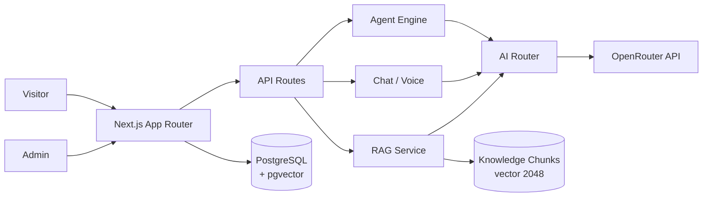
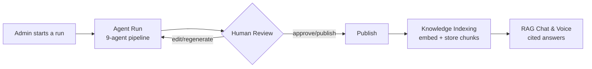

# AutoAI For Nature

> 🧠 **AI Software Engineering Field Guide** — 20 engineering lessons and 7 real production
> case studies from building, debugging, testing and shipping AutoAI.
> Start with the [10-minute Quick Start](./docs/AI-SOFTWARE-ENGINEERING-FIELD-GUIDE.md#start-here--10-minutes-that-can-change-how-you-build-ai-systems),
> follow the [30-minute practical path](./docs/AI-SOFTWARE-ENGINEERING-FIELD-GUIDE.md#got-30-minutes),
> or explore the
> [full engineering guide (Markdown)](./docs/AI-SOFTWARE-ENGINEERING-FIELD-GUIDE.md) ·
> [interactive HTML edition](./docs/ai-software-engineering-field-guide.html)
> *(download/open locally — GitHub shows HTML as source)*.

An AI-powered nature content platform. AutoAI For Nature combines **agentic
article generation** (a 9-agent editorial pipeline with a human-in-the-loop
review stage), **retrieval-augmented generation (RAG)** over a pgvector
knowledge base, an **AI chatbot with source citations**, a **voice agent**,
a read-only **MCP server**, and **workflow automation** — all behind a
bilingual (English/Persian) public site and a full admin dashboard.

| | |
|---|---|
| **Status** | V1 — Showcase / Production Preparation (not yet deployed) |
| **Verified live path** | Admin login → real AI article generation → human review → publish → knowledge indexing → RAG chat |
| **Stack** | Next.js 15 (App Router), React 19, TypeScript, Tailwind CSS, drizzle-orm, PostgreSQL + pgvector |
| **License** | MIT |

---

## Overview

AutoAI For Nature is an AI-native content and knowledge platform focused on
nature, wildlife and environmental topics. Instead of a single "generate text"
call, it models a small editorial newsroom: agents propose ideas, plan,
research, write, critique and revise articles; a human editor reviews the
result before anything is published; published content is automatically
indexed into a vector knowledge base that powers grounded chat and voice
answers with citations.

The platform runs fully offline in development through a deterministic `mock`
provider. The mock is **hard-disabled on real AI paths in production** — live
generation requires a configured real provider.

## Key Features

Implemented in V1:

- **AI article generation** from a topic prompt (English or Persian)
- **9-agent content pipeline**: Idea Scout → Strategist → Researcher → Writer
  → Critic → SEO → Publisher → Final Critic → Lessons
- **Critic-driven revision loop** with configurable quality threshold and max
  rounds
- **Human review workflow**: generated posts land in `waiting_for_human` /
  `needs_review`; editors can edit, preview, approve (publish), reject or
  regenerate with feedback
- **RAG knowledge base**: curated documents and published articles are chunked
  and embedded into pgvector for similarity search
- **Vector search** with cosine distance and strict embedding-identity
  guarding (vectors from different provider/model combinations are never mixed)
- **AI chatbot** with streaming responses, retrieved sources and per-source
  relevance scores; honest "no relevant knowledge" fallback
- **Voice agent**: browser speech recognition/synthesis plus an RAG-grounded
  `/api/voice` answer pipeline
- **MCP server** (Streamable HTTP + stdio) exposing 12 read-only tools,
  protected by a bearer secret and invocation logging
- **Workflows & cron**: nightly backup workflow at `/api/cron/nightly-backup`
  (registered in `vercel.json`, secret-protected)
- **Admin dashboard**: overview stats, posts, agent run timelines, knowledge
  management, conversations, voice settings, model/provider configuration,
  MCP log, workflows and system settings
- **Internationalization**: English and Persian UI dictionaries with full RTL
  support

## Architecture

High-level request/AI flow:



Editorial flow:



Technology notes:

- **Next.js 15** App Router + React 19 + TypeScript + Tailwind CSS
- **drizzle-orm** schema and SQL migrations (`drizzle/`) over PostgreSQL +
  **pgvector**
- **Database adapter**: with `DATABASE_URL` set the app uses PostgreSQL via
  `node-postgres`; without it, local development falls back to embedded
  PGlite (`.pglite/`). Production refuses to boot without `DATABASE_URL`.
- **Auth**: single admin role, JWT session cookie signed with `AUTH_SECRET`
  (`jose`), bcrypt password hashing; middleware protects `/admin` and
  `/api/admin`

## AI Architecture

- **Provider abstraction**: every AI capability (chat, structured output,
  embeddings) goes through providers implementing one interface.
- **AI router**: each *purpose* (idea, writer, critic, chat, embedding, …) has
  its own primary/fallback provider+model configuration stored in the database
  (with env defaults). Attempts are retried across primary → fallback with
  hard timeouts.
- **Structured output**: agent responses are validated with zod schemas;
  invalid output triggers repair/retry instead of leaking malformed JSON into
  the pipeline.
- **Real-provider protection**: before any user-facing generation the system
  pre-flights that a real provider is configured
  (`assertRealProviderReady`); otherwise it fails fast with
  `AiNotConfiguredError` rather than silently producing mock content. The mock
  provider is only reachable under automated tests (`AUTOAI_ALLOW_MOCK=1`) or
  explicit demo configuration outside production.
- **Providers available**: `openrouter`, `openai`, `anthropic`,
  `google` (Gemini), `groq`, plus `mock` for dev/tests. Keys are read from
  server-side environment variables (or entered by the admin in Settings,
  stored server-side).

Current verified configuration:

| Role | Value |
|---|---|
| Provider | OpenRouter |
| LLM | `openai/gpt-4o-mini` |
| Embeddings | `nvidia/nemotron-3-embed-1b:free` |
| Embedding dimensions | 2048 |

No API keys are stored in this repository.

## RAG Architecture

```mermaid
flowchart LR
    D[Documents<br/>curated + published articles] --> C[Chunking]
    C --> E[Embedding<br/>routerEmbedding]
    E --> V[(pgvector<br/>knowledge_chunks.vector(2048))]
    Q[User query] --> QE[Query embedding]
    QE --> S[Cosine similarity search<br/>top-k]
    S --> CTX[Retrieved context]
    CTX --> LLM[LLM answer<br/>with cited sources]
```

- Documents and posts are split into overlapping chunks, embedded, and stored
  in `knowledge_chunks.embedding` as **`vector(2048)`**.
- The canonical dimension is defined once (`EMBEDDING_DIMENSIONS`); embeddings
  that don't match are rejected loudly — never truncated or padded.
- Every document records its embedding `provider` / `model` / `dimensions`;
  retrieval only compares vectors produced by the exact same provider+model.
- Relevance thresholds are provider-aware (real embeddings ≥ 0.4 similarity).
- **Changing the embedding model requires a full knowledge-base re-index**
  (admin Knowledge page → re-index all, which wipes and rebuilds every vector
  so no stale/mixed embeddings remain).

## Agent Pipeline

The actual V1 execution order:

```
Idea → Strategist → Researcher → Writer ⇄ Critic → SEO → Publisher
      → Final Critic → Lessons
```

- Each agent is an LLM step with its own prompt, zod contract, persisted step
  record (provider, model, latency, retries, input/output summaries, score)
  and a visible timeline in the admin run view.
- The Writer/Critic pair forms a **revision loop**: the critic scores the draft
  against a configurable quality threshold; below-threshold drafts go back to
  the writer until the score passes or the configured maximum rounds is
  reached (then the post follows the configured outcome: needs review, draft,
  or publish).
- The **Lessons** agent extracts takeaways that are stored as active lessons
  and injected into future prompts of the same agent — the pipeline improves
  from its own runs.
- Disabled agents (via configuration) are skipped and recorded as such.

## Human Review

Generated articles do not auto-publish by default:

```
waiting_for_human  →  edit  →  preview  →  approve  →  publish
                          ↘ reject (reason required)
                          ↘ regenerate (new agent run)
```

- After a run finishes, the post sits in `needs_review`.
- Editors edit the article, preview it, then approve (publishes with a
  recorded revision + reason) or reject (requires a reason, also recorded).
- Regenerate launches a fresh pipeline run for the same post.
- Publishing mirrors the final article into the knowledge base and indexes it
  with the configured real embedding provider, making it retrievable by chat
  and voice immediately.

## Voice Agent

- **Speech I/O**: browser Web Speech API (`SpeechRecognition` for STT,
  `speechSynthesis` for TTS) — free, native, no external voice vendor required
  and no API key. The UI degrades gracefully where unsupported.
- **Answer pipeline**: `/api/voice` sends the transcript through the same
  RAG retrieval as chat and answers from the knowledge base with citations.
- Voice behavior (STT/TTS provider fields, greeting, system prompt, RAG on/off,
  save conversations, temperature/speed) is configurable in the admin Voice
  page and stored in the database (`voice_configs`) — not in env vars.
- Advanced third-party voice vendors (e.g. ElevenLabs) are **not** required by
  V1; richer voice providers are roadmap items.

## MCP

- **MCP server** exposed two ways:
  - Streamable HTTP at `/api/mcp`
  - stdio locally: `npm run mcp`
- **Authentication**: requests must send `Authorization: Bearer <MCP_SECRET>`.
  In production the endpoint fails closed when the secret is not configured.
- **Read-only tools** (12): `list_posts`, `get_post`, `search_knowledge`,
  `list_agent_runs`, `get_agent_run`, `list_categories`, `get_vector_stats`,
  `list_backups`, `list_workflow_runs`, `list_lessons`, `get_conversation`,
  `list_models`.
- MCP tools **cannot mutate** application data — they observe content, runs,
  knowledge and configuration state only.
- Every invocation is logged and visible in the admin MCP page.

## Workflows

Implemented today:

- **Nightly backup** workflow: `/api/cron/nightly-backup`, registered in
  `vercel.json` (`0 0 * * *`) for Vercel Cron.
- **Cron protection**: requests must carry
  `Authorization: Bearer <CRON_SECRET>` (Vercel sends this automatically when
  the variable is set). Without the secret the endpoint fails closed in
  production.
- Backup history is visible in the admin Workflows page.

Richer multi-step automation (social publishing, scheduled generation, etc.)
is roadmap, not implemented.

## Admin Dashboard

| Area | Purpose |
|---|---|
| Overview | Activity stats, recent runs/posts, system health |
| Posts | Create/edit/review articles, review queue actions |
| Agent Runs | Run list, per-step timeline, retry failed runs |
| Knowledge | Curated documents, indexing status, re-index (single/all) |
| Conversations | Saved chat conversations and messages |
| Voice | Voice agent configuration and test |
| Models | Provider connections, default LLM/embedding config, live connection test |
| MCP | MCP invocation log and tool reference |
| Workflows | Workflow definitions, backup history |
| Settings | System settings (revision policy, RAG chunking/search/sources) |

First-run setup creates the admin account in the browser (`/admin/setup`).

## Internationalization

- English (`en`) and Persian (`fa`) dictionaries (`messages/en.json`,
  `messages/fa.json`)
- Locale switcher on the public site
- Full **RTL support**: `<html dir>` flips for Persian, article rendering and
  editor respect content language direction

## Database

- Schema: `src/db/schema` (drizzle), SQL migrations: `drizzle/`
- **Development**: without `DATABASE_URL` the app uses embedded
  [PGlite](https://github.com/electric-sql/pglite) (local Postgres in
  `.pglite/`). PGlite is a **development convenience only — never use it in
  production**.
- **Production**: PostgreSQL **with the pgvector extension** via
  `DATABASE_URL`. The app refuses to boot in production without it.
- `npm run db:migrate` applies migrations, enables
  `CREATE EXTENSION IF NOT EXISTS vector`, and verifies the
  2048-dimensional column contract afterwards.
- Knowledge vectors are `vector(2048)` to match the verified embedding model.

## Local Development

Requirements: Node.js ≥ 20.

```bash
npm install
cp .env.example .env.local   # Windows PowerShell: Copy-Item .env.example .env.local
npm run db:migrate           # create schema (PGlite locally)
npm run dev                  # http://localhost:3000
```

Sign in at `/admin` (first run offers account setup). In development the
bootstrap credentials come from `ADMIN_EMAIL` / `ADMIN_PASSWORD`
(demo defaults: `admin@autoai.local` / `autoai-admin`). These well-known
defaults are **disabled in production**.

All scripts (from `package.json`):

| Command | Purpose |
|---|---|
| `npm run dev` | Start Next.js dev server |
| `npm run build` | Production build |
| `npm start` | Serve the production build |
| `npm run lint` | ESLint |
| `npm run typecheck` | TypeScript, no emit |
| `npm test` / `npm run test:watch` | Vitest suite (offline, deterministic) |
| `npm run db:generate` | Generate drizzle migration files |
| `npm run db:migrate` | Apply migrations (PGlite or `DATABASE_URL`) |
| `npm run db:seed` | Seed demo data (**dev only**, refused in production) |
| `npm run db:reset:production -- --yes` | Wipe production content rows, keep schema/config |
| `npm run mcp` | Start the MCP server over stdio |

## Environment Variables

See [`.env.example`](./.env.example) for the authoritative annotated list.
Variable names only — never commit values:

| Variable | Purpose | Secret |
|---|---|---|
| `DATABASE_URL` | PostgreSQL (+pgvector) connection string; required in production | yes |
| `ADMIN_EMAIL` | Production bootstrap admin email | yes |
| `ADMIN_PASSWORD` | Production bootstrap admin password | yes |
| `AUTH_SECRET` | Signs admin session JWTs (32+ random chars; required in production) | yes |
| `OPENROUTER_API_KEY` | OpenRouter API key | yes |
| `OPENAI_API_KEY` | OpenAI API key | yes |
| `ANTHROPIC_API_KEY` | Anthropic API key | yes |
| `GEMINI_API_KEY` | Google Gemini API key | yes |
| `GROQ_API_KEY` | Groq API key | yes |
| `OPENROUTER_BASE_URL` | Optional override (integration tests only) | no |
| `DEFAULT_AI_PROVIDER` | Fallback default LLM provider (verified: `openrouter`) | no |
| `DEFAULT_AI_MODEL` | Fallback default LLM model (verified: `openai/gpt-4o-mini`) | no |
| `DEFAULT_EMBEDDING_PROVIDER` | Fallback default embedding provider (verified: `openrouter`) | no |
| `DEFAULT_EMBEDDING_MODEL` | Fallback default embedding model (verified: `nvidia/nemotron-3-embed-1b:free`) | no |
| `MCP_SECRET` | Bearer secret for `/api/mcp`; required in production | yes |
| `CRON_SECRET` | Bearer secret for cron endpoints; required in production | yes |
| `NEXT_PUBLIC_APP_URL` | Absolute site URL for canonical links/SEO | no |

Internal/test-only flags (never set in production): `AUTOAI_ALLOW_MOCK`,
`AUTOAI_ALLOW_DEMO_SEED`, `AUTOAI_QUIET`.

All secrets are server-side only; nothing sensitive uses the `NEXT_PUBLIC_`
prefix.

## Production Deployment

Intended architecture:

```
GitHub → Vercel → Managed PostgreSQL (+ pgvector) ← app → OpenRouter
```

> **Not yet deployed.** These are the prepared steps for the next phase.

1. Create a managed PostgreSQL database **with pgvector available**
   (e.g. Neon).
2. Set `DATABASE_URL` (with `sslmode=require` if the provider requires TLS).
3. Set production secrets: `AUTH_SECRET`, `ADMIN_EMAIL`, `ADMIN_PASSWORD`,
   `MCP_SECRET`, `CRON_SECRET`, plus your provider key(s)
   (e.g. `OPENROUTER_API_KEY`) and the default provider/model variables.
4. Run migrations once against the new database: `npm run db:migrate`.
5. Deploy to Vercel (imports `vercel.json`, registering the nightly-backup
   cron).
6. Verify `/api/health` and admin login.
7. Configure AI: enter the provider key in Admin → Models, set the default
   LLM and embedding model, run the built-in live connection test.
8. Run a production smoke test of the P0 flow: generate → review → publish →
   ask the chatbot about the published article.

No local filesystem persistence and no long-running Node process are required
in production.

## Security

- All API keys and secrets are **server-side only** (env vars or the admin's
  encrypted-at-rest provider config table); nothing is exposed via
  `NEXT_PUBLIC_*`.
- `/admin` and `/api/admin` are protected by middleware + JWT session cookies
  (`AUTH_SECRET`); production requires explicit admin credentials — well-known
  demo defaults are disabled.
- MCP endpoints require the `MCP_SECRET` bearer token and fail closed in
  production; tools are read-only.
- Cron endpoints require the `CRON_SECRET` bearer token and fail closed in
  production.
- The mock AI provider is blocked on user-facing paths in production — no
  silent fake content.
- No secrets, `.env*` files, local databases, logs or build artifacts are
  committed to this repository (see `.gitignore`).

## Testing

- `npm test` — **43 tests passing** across 7 Vitest suites (provider mock
  behavior, AI router, structured output, defaults, RAG chunking, i18n,
  utilities). The suite is offline and deterministic (mock provider).
- `npm run typecheck` and `npm run build` pass cleanly.
- The end-to-end P0 customer flow (login → real AI generation → review →
  publish → retrieval → RAG chat) was verified manually against live
  OpenRouter APIs; see [`docs/AUTOAI_V1_ACCEPTANCE_REPORT.md`](./docs/AUTOAI_V1_ACCEPTANCE_REPORT.md)
  for the detailed acceptance evidence.

## Project Status

**V1 — Showcase / Production preparation complete.** The application code,
migrations and deployment configuration are ready; hosted infrastructure
(managed PostgreSQL, Vercel project, production smoke test) is the next phase
and has **not** been deployed yet.

## Roadmap (V2)

Planned — **not implemented in V1**:

- Automated social content generation
- Instagram integration
- Telegram integration
- YouTube ingestion
- Facebook integration
- Automated multi-platform publishing
- Richer visual workflow builder
- Additional AI providers and models
- Advanced cloud voice providers

## License

MIT — see [LICENSE](./LICENSE).
